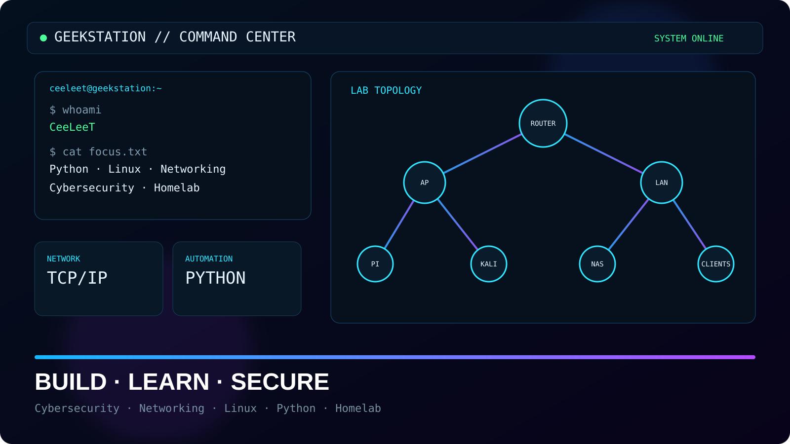

# GeekStation Portfolio



Persönliches Portfolio und Homelab-Dashboard für **Cybersecurity, Networking, Linux und Python**.

## Bereiche

- Featured Projects
- Project Archive
- Tech Stack
- Homelab Focus
- Vereinfachte Netzwerk-Topologie
- Dokumentierter Lernpfad

## Struktur

```text
.
├── index.html              # Hauptseite und semantische Inhaltsstruktur
├── assets/
│   ├── style.css           # Designsystem, Layout und Responsive Styles
│   ├── app.js              # Kleine clientseitige Helfer
│   └── geekstation-preview.svg  # Portfolio-Vorschaubild
└── README.md
```

Der Quellcode ist bewusst kommentiert, damit sich Aufbau und Styling später leichter erweitern lassen.

> Security-Hinweis: Öffentliche Darstellungen des Homelabs sind absichtlich vereinfacht und enthalten keine Zugangsdaten oder privaten IP-Adressen.
