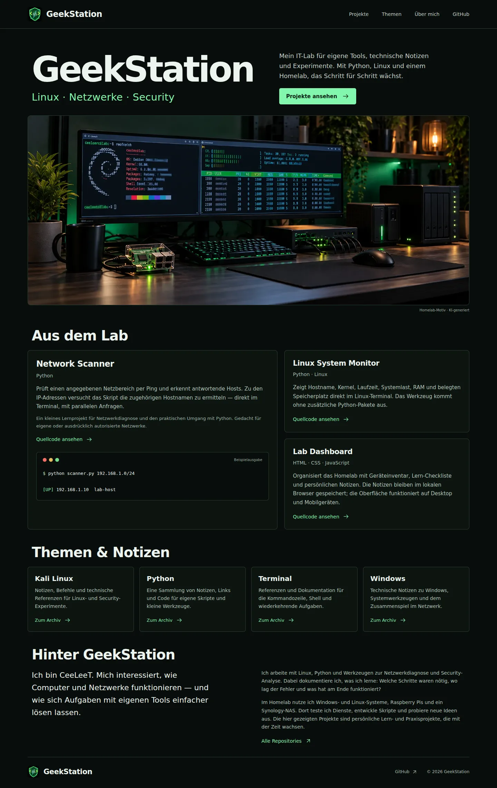

# GeekStation

Persönliches IT-Portfolio von **CeeLeeT**: Linux, Netzwerke, Python und Cybersecurity.

**Website:** https://ceeleet.github.io/



## Inhalte

- Drei eigene Lernprojekte: Network Scanner, Linux System Monitor und Lab Dashboard.
- Themenarchive für Kali Linux, Python, Terminal und Windows.
- Kurze persönliche Einordnung der Arbeit mit Linux, Python und dem Homelab.

## Aufbau

| Datei | Aufgabe |
|---|---|
| `index.html` | Inhalte, Navigation und Metadaten |
| `assets/style.css` | Durchgehend dunkles Design und responsive Layouts |
| `assets/app.js` | Mobiles Menü und Jahreszahl |
| `assets/geekstation-logo.svg` | Vorhandenes GeekStation-Schildlogo |
| `assets/homelab.webp` | Optimiertes Homelab-Motiv für große Bildschirme |
| `assets/homelab-small.webp` | Kleinere Bildversion für mobile Geräte |
| `assets/apple-touch-icon.png` | Logo für iOS-Lesezeichen |
| `assets/portfolio-preview.webp` | Vorschau der tatsächlichen Website |

## Lokal ansehen

Im Projektordner:

```bash
python3 -m http.server 8080
```

Dann http://localhost:8080 öffnen. Kein Build-Schritt, keine externen Schriften und keine Analyse-Tracker. Die Inhalte und die Navigation sind auch ohne JavaScript erreichbar; JavaScript ergänzt das einklappbare mobile Menü.

## Pflege

Texte und Links werden in `index.html` bearbeitet. Farben und Abstände sind zentral in `assets/style.css` definiert. Alle Bilder liegen im Repository; das Homelab-Motiv ist KI-generiert und zeigt keinen tatsächlichen privaten Raum. Die Terminalausgabe auf der Seite ist ein gekennzeichnetes Beispiel.

Veröffentlicht wird über GitHub Pages aus `main`. Details zur Gestaltung und Prüfung stehen in [docs/design-and-validation.md](docs/design-and-validation.md).
